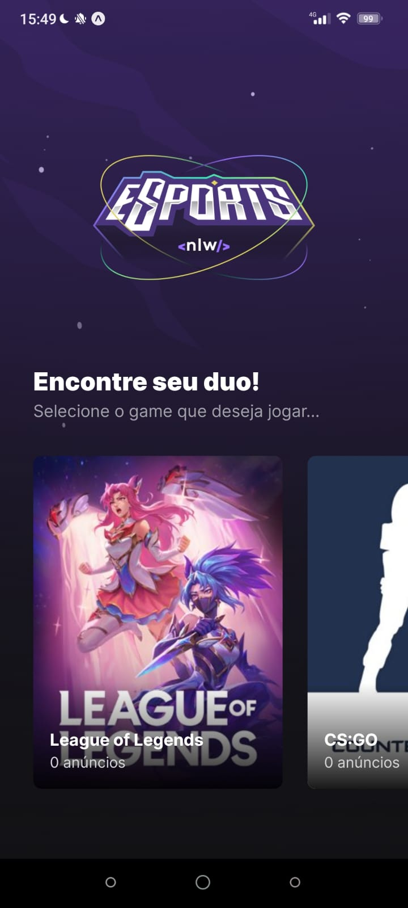

<h1 align="center">Mobile - React Native</h1>

## :man_technologist: Tecnologias utilizadas

- Criação do projeto com o Expo;
- React Native;
- React Navigation - Stack Navigator;
- Phosphor Icons para o uso de ícones;
- Expo-Clipboard copiar o discord para a área de transferência;

## :dart: Funcionalidades

- Consumo de API - Conexão do mobile com o back-end;
- Criação da Home Page - Listagem dos games disponíveis;
- Criação da Game Page - Lista informação do game e os anúncios disponíveis;
- Clipboard - Copiar o discord do Duo para a área de transferência;

## :camera: Screenshot

https://user-images.githubusercontent.com/48128325/194093524-eb4f0846-b485-46ca-b7f4-1e3ecbee24f3.mp4

  

    <h3>Página Home</h3>
    
  

  

  

    <h3>Página Game - Sem anúncio</h3>
    
  

  

  

    <h3>Página Game - Com anúncio</h3>
    
  

  

  

    <h3>Conectando com um Duo</h3>
    
  

  

  

    <h3>Copiar discord</h3>
    
  

