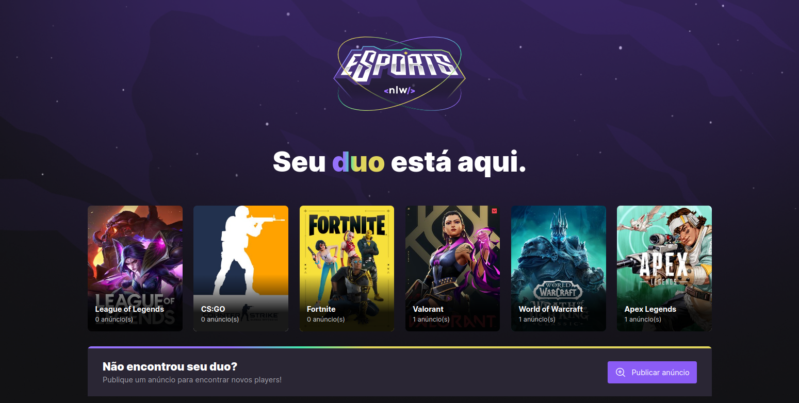
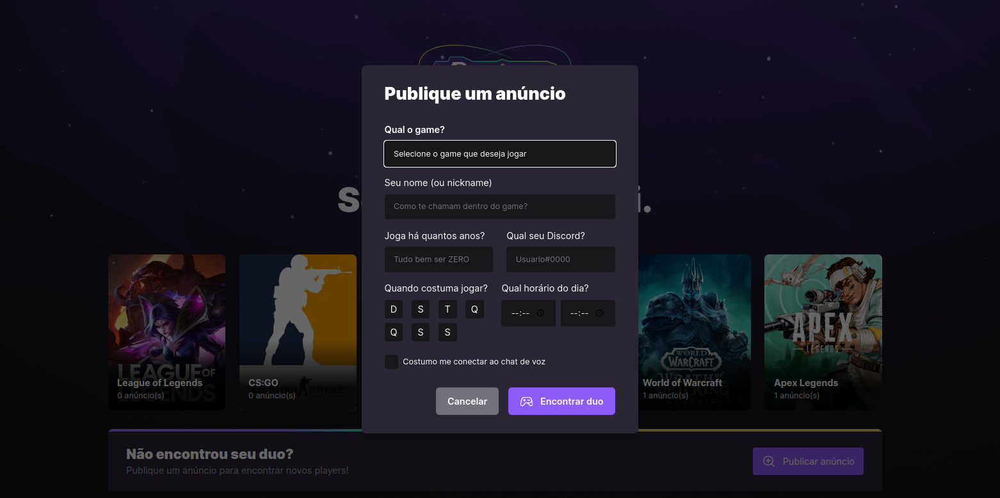

# WEB

## :man_computer: Tecnologias utilizadas

- Criação do projeto web utilizando Vite;
- React;
- Typescript; 
- Hooks;
- Phosphor Icons para o uso de ícones;
- Radix UI para criar a tela de modal e o checkbox;

## Funcionalidades

- Criação da Landing Page;
- Consumo de API (games no back-end);
- Listagem dos games disponíveis;
- Criação de Modal para o cadastro de novos anúncios (ads);

## :camera: Screenshot

  <h3 align="center">Landing Page</h3>
  

    
  <h3>Modal: Publicar um anúncio de duo</h3>
  

